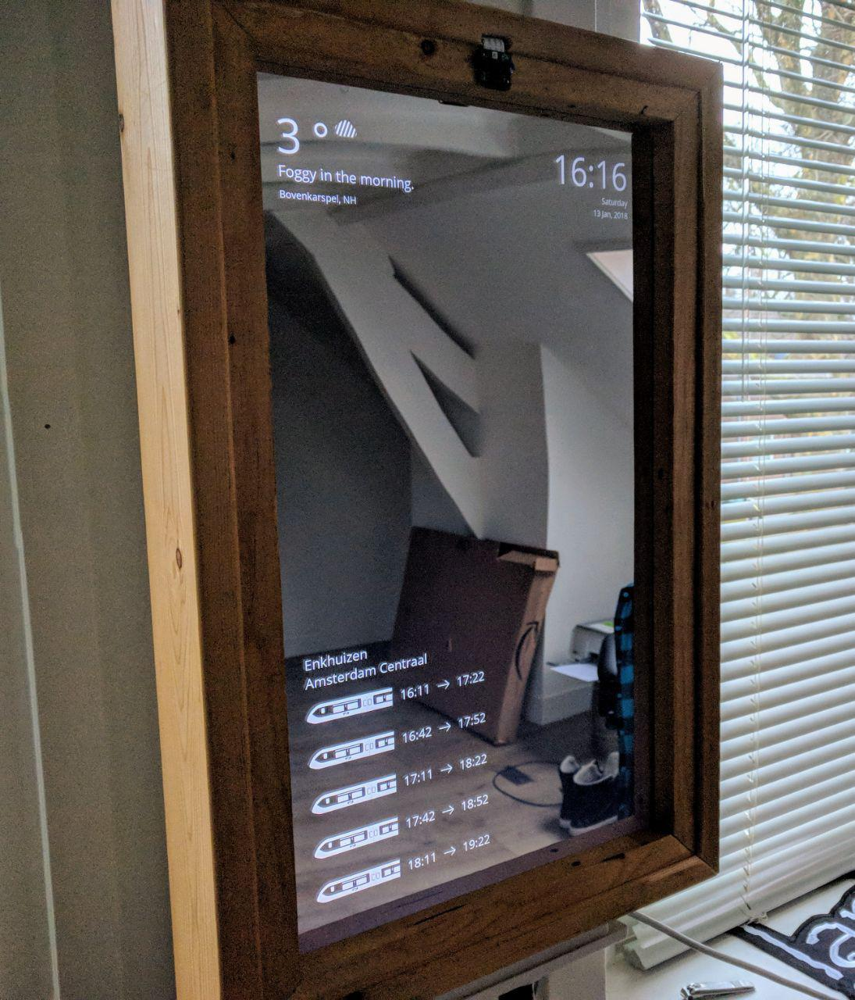
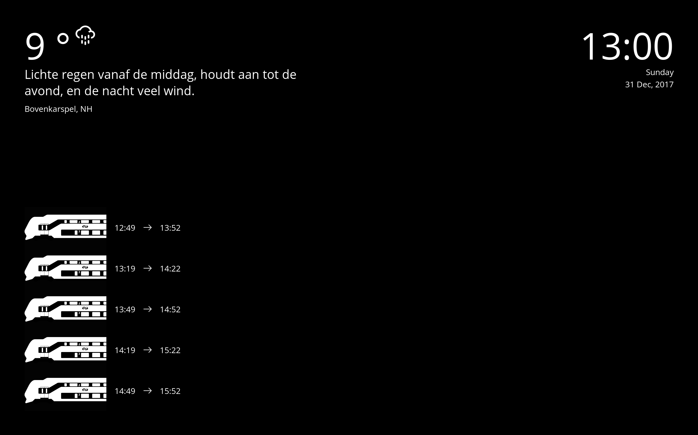

# Mirror

This is my version of the famous
[Smart Mirror](https://github.com/HackerHouseYT/Smart-Mirror/) project. The
widgets on the screen will animate in once there has been a face detected.

The project is built with Flask & React.

# Installation

- `$ git clone https://github.com/kkoomen/mirror.git && cd mirror/`
- `$ ./setup.sh`

# Setup

- Put your DarkSky weather API token in `./server/src/.env`.
- Open `./server/src/settings.py` and enter your daily departure / arrival
  locations.

# Run the app

### Terminal 1

- `$ cd ./server/`
- `$ source ./env/bin/activate`
- `$ cd ./src/`
- `$ ./main.py`

### Terminal 2

- `$ cd ./client/`
- `$ npm run start`

or you can run `$ npm run build` if you want a compressed version.
