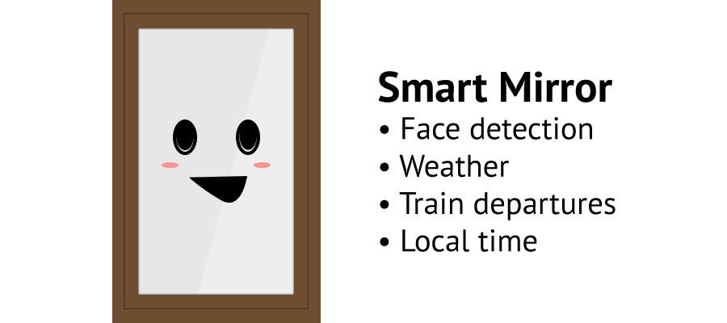
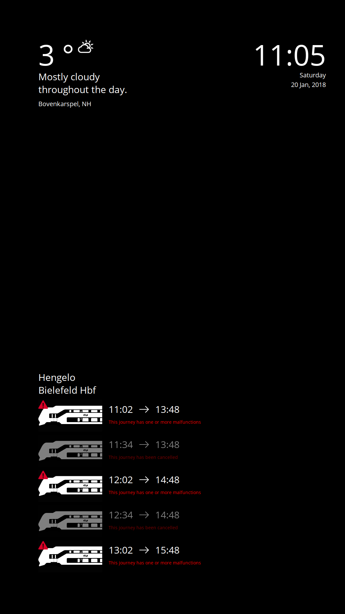

# Mirror

This is my version of the famous
[Smart Mirror](https://github.com/HackerHouseYT/Smart-Mirror/) project. The
widgets on the screen will animate in once there has been a face detected. When
the room is too dark it is unable to recognize faces so it will always show the
data at that moment.

The project is built with Flask & React used on a Raspberry PI Model B.

# Installation

- `$ sudo apt-get install apache2`
- `$ sudo chown -R $USER:$USER /var/www`
- `$ rm -rf /var/www/html # optional`
- `$ git clone git@github.com:kkoomen/mirror.git /var/www/mirror && cd /var/www/mirror`
- `./scripts/setup.sh`

# Setup

Open `./server/src/.env` and fill in all the variables.

# Additional features

### Rotate screen

Since the mirror is in portrait mode we have to flip the screen 90 degrees.
Add `display_rotate=1` to `/boot/config.txt` and reboot to apply changes.
